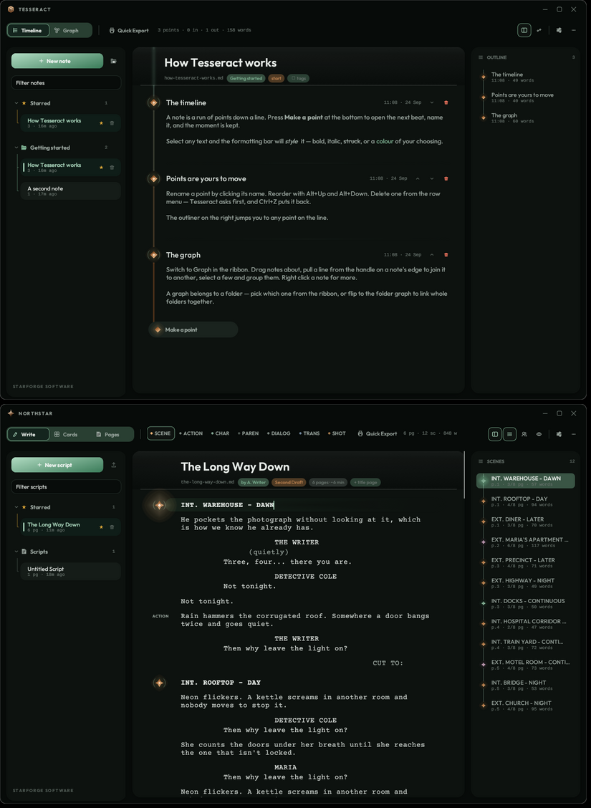

# Northstar

**A screenwriting studio for Linux.** By Starforge Software.

It behaves like a notes app — open it, type, it saves itself — but every
paragraph is a typed screenplay element, laid out to standard master-scene
geometry and exportable as a print-ready PDF, a Final Draft file or Fountain.

Scripts are stored as plain markdown in `~/.local/share/northstar/scripts`, so
your work stays greppable, diffable, and yours.

Northstar is drawn in the same design language as
[Tesseract](https://github.com/exiledddev/tesseract) — the same islands on
glass, the same palettes, glow, motion, type and controls — so the two sit on
a desktop as one family. It does not share Tesseract's features, only its
look; and with **Match Tesseract** on (the default) it wears whatever theme
Tesseract is wearing, live.



---

## Installing

Written for **Pop!\_OS, Debian and Ubuntu** (22.04 and later), on **KDE
Plasma** or GNOME.

```bash
# 1. Rust, from rustup (the version in apt is usually too old for the GUI stack)
curl --proto '=https' --tlsv1.2 -sSf https://sh.rustup.rs | sh
source "$HOME/.cargo/env"

# 2. Northstar
git clone https://github.com/exiledddev/northstar.git
cd northstar
./install.sh
```

`install.sh` checks for the build dependencies and installs any that are
missing with `apt` (it asks for your password once, for `sudo`):

```
build-essential pkg-config libgl1-mesa-dev libx11-dev libxcursor-dev
libxrandr-dev libxi-dev libxkbcommon-dev libxkbcommon-x11-dev libwayland-dev
```

then builds with `cargo build --release`, installs the binary to
`~/.local/bin/northstar`, and registers a launcher entry and icon so it shows
up in the KDE application menu (the menu cache is rebuilt for you). The icon is
drawn by the app itself (`northstar --emit-icon`), so it always matches the
mark inside the app.

If `~/.local/bin` is not on your `PATH`, the script says so and tells you the
line to add.

**Upgrading** from the first Northstar: `git pull` (or re-clone) and run
`./install.sh` again. It replaces `~/.local/bin/northstar` in place. Your
scripts are untouched and open exactly as before — the file format only grew.

**Uninstalling:** `./install.sh --uninstall`. Your scripts stay in
`~/.local/share/northstar`.

Fonts need nothing extra: Outfit (the interface) and Courier Prime (the page)
ship inside the binary.

---

## The window

Northstar has no desktop title bar. It draws its own: the mark, the name and
the three window buttons along the top, the whole strip draggable, a
double-click to maximise, and invisible grips down every edge for resizing.

The design is islands on a blurred backdrop. The window is **one sheet of
glass**; anything you *work in* — the library, the page, the scene navigator —
is an opaque rounded island floating on it. There are no frames and no
hairlines on the seams: an island is told apart from the backdrop by being
opaque and by the gap around it.

| Session | What happens |
| --- | --- |
| **KDE Plasma on X11** | `_KDE_NET_WM_BLUR_BEHIND_REGION` is set on the window, cut to its rounded outline. |
| **KDE Plasma on Wayland** | Blur is requested through `org_kde_kwin_blur`. |
| **Anything else** | The glass is painted nearly solid instead, so the design still reads. |

Settings → **Window blur** says what your session managed, and lets you force
it on or off.

---

## Three views

The switch at the left of the ribbon (`Ctrl+G` steps through them):

**Write** — the script, one typed block per paragraph, at industry indents in
Courier Prime. The block you are in gets a wash of the accent; every scene
heading carries a four-pointed star in the gutter that lights while you are in
its scene. A faint rule marks where each printed page will begin, numbered the
way the PDF numbers it.

**Cards** — every scene as an index card: its number, heading, where it falls
and how long it runs (in eighths of a page), who speaks in it, and a synopsis
you write straight onto the card. Drag a card by its head to move the whole
scene; right-click for a card colour or to delete the scene (it asks first,
and `Ctrl+Z` brings it back).

**Pages** — the script exactly as it will print, title page first, drawn from
the same layout pass the PDF is written from. Two pages side by side when there
is room. Click any line to go and write it.

On the right, the **scene navigator** lists every scene on a mini rail of its
own, with the page it starts on, its length in eighths and its word count;
click one to jump to it. **Cast** lists everyone who speaks, most lines first —
click a name to step through their cues — and shows how much of the script is
dialogue.

---

## Writing in it

The whole editor is keyboard-driven. Each block of text has an element type,
and the type decides the indent, the width, and whether it is forced to caps.

| Key | Does |
|---|---|
| `Enter` | New block. The type is chosen for you: Character → Dialogue, Dialogue → Action, Scene Heading → Action, Transition → Scene Heading |
| `Shift+Enter` | New block of the *same* type |
| `Tab` / `Shift+Tab` | Cycle the current block's type forward / back — or, when SmartType is offering something, `Tab` takes it |
| `Ctrl+1…7` | Set type directly (Scene Heading, Action, Character, Parenthetical, Dialogue, Transition, Shot) |
| `Backspace` at the head of a block | Merge into the block above, or delete it if empty |
| `Delete` at the end of a block | Pull the block below up into it, when it is the same type or empty |
| `↑` / `↓` at the edges of a block | Move between blocks |
| `Alt+↑` / `Alt+↓` | Move the whole block up or down |
| `Ctrl+Enter` | A new scene straight after the one you are in |
| `Ctrl+S` | Save now (also renames the file to match the title) |
| `Ctrl+Z` / `Ctrl+Shift+Z` or `Ctrl+Y` | Undo / redo, document-wide |
| `Ctrl+N` | New script — its title is selected, ready to type over |
| `Ctrl+E` | Quick Export: PDF, then open it (or show it, or nothing — Settings) |
| `Ctrl+F` / `Ctrl+H` | Find and replace in the script |
| `Ctrl+Shift+F` | Filter the library |
| `Ctrl+G` | Write → Cards → Pages |
| `Ctrl+B` | Show / hide the library |
| `Ctrl+I` | Show / hide the scene navigator |
| `Ctrl+.` | Focus: hide both side islands and dim everything outside this scene |
| `Ctrl+±` | Page text bigger / smaller (remembered) |
| `Ctrl+,` | Settings |
| `Esc` | Close whatever is open |

Typing is saved automatically about a second after you stop. The ribbon says
`unsaved` while there is something to save, and `saved 2m ago` after.

**SmartType** finishes what you are typing, in ghost ink after the caret:
character names from everyone who already speaks, `INT.` / `EXT.` and the
places you have already used in scene headings, the usual times of day after
` - `, and the standard transitions. `Tab` takes it; keep typing to ignore it.

Paste is smart: if you paste several lines at once, each line is guessed into
the right element (`INT.`/`EXT.` → scene heading, `(…)` → parenthetical,
`… TO:` → transition, short all-caps line → character, a line right after a
character → dialogue).

---

## Format

Layout follows the standard the Google Docs template on johnhaller.com
approximates — 12pt Courier at 10 characters per inch, 1.5″ left margin, 1″
right, 1″ top and bottom, which gives a 60-character text column and 55 lines
to a page.

| Element | Indent from page left | Width | Caps |
|---|---|---|---|
| Scene heading | 1.5″ | 6.0″ | yes |
| Action | 1.5″ | 6.0″ | no |
| Character | 3.7″ | 3.8″ | yes |
| Parenthetical | 3.1″ | 2.8″ | no |
| Dialogue | 2.5″ | 3.5″ | no |
| Transition | 6.0″ | 1.5″ | yes |
| Shot | 1.5″ | 6.0″ | yes |

The page count comes from the same layout pass the PDF exporter uses, so it
isn't an estimate — it is the real page count, and one page ≈ one minute of
screen time. Scene lengths are measured on it too, in eighths of a page, the
unit a shooting schedule is drawn up in.

---

## Files

```
~/.local/share/northstar/
    scripts/       one .md per screenplay
    exports/       pdf / fdx / fountain / txt output
    snapshots/     dated copies, one folder per script
    settings.conf  what you have chosen, key = value
```

Each script is CommonMark with YAML front matter. Every element maps to exactly
one markdown construct, so the round trip is lossless and the file still reads
properly in any markdown viewer:

```markdown
---
title: The Long Way Down
author: A. Writer
contact:
draft: First Draft
---

## INT. WAREHOUSE - NIGHT
<!-- scene: tint=2 | Maria finds the door that isn't locked. -->

Rain hammers the corrugated roof.

**MARIA (V.O.)**

*(barely audible)*

> Three, four... there you are.

### ANGLE ON THE DOOR

`SMASH CUT TO:`
```

`##` scene heading · `###` shot · plain paragraph action · `**bold**` character
· `*(italic parens)*` parenthetical · `>` dialogue · `` `code` `` transition.

A scene's index card — its synopsis and colour — rides directly under its
heading as an HTML comment, which markdown viewers hide. A starred script has
`starred: yes` in its front matter. Both are only written when used, so a
script without them is byte-for-byte what the first Northstar wrote.

Drop a hand-written file into `scripts/` following those rules and it shows up
in the library on its own. Anything unrecognised becomes action rather than
being dropped.

**Export** (the `⋯` menu) gives you PDF (title page, page numbers, proper
Courier geometry, and scene numbers in both margins if you turn them on),
**Final Draft** `.fdx`, **Fountain** (for Highland, Beat, afterwriting…), or
plain text.

**Import** — the arrow beside *New script*, the `⋯` menu, dropping a file onto
the window, or `northstar some-file.fountain` — reads Fountain, Final Draft
and Northstar markdown into a new script. The file picker is KDE's own dialog
(`kdialog`) where there is one, GNOME's (`zenity`) otherwise.

**Snapshots** (`⋯` → *Take a snapshot* / *Snapshots…*) put a dated copy of the
script aside. Restoring one asks first, and keeps what was there as a snapshot
too, so nothing is ever lost.

---

## Settings

Theme (five, each light or dark: Zen, Ember, Frostbite, Bloodmoon, Void — the
same five as Tesseract), **Match Tesseract**, animations, window blur, how solid
the glass is, interface size, page text size, page breaks in the editor, scene
numbers, SmartType, typewriter scrolling, how the library sorts, a session word
goal (shown as a track in the ribbon), the splash screen, what Quick Export does
with the PDF, and how long the app waits before saving.

With **Match Tesseract** on, theme, light/dark, glass, blur and motion are read
from `~/.local/share/tesseract/settings.conf` and followed as Tesseract changes
them. Choosing a look by hand in Northstar turns matching off. Without
Tesseract installed, Northstar starts in Bloodmoon, its own red.

---

## Anything that deletes, asks

Deleting a script, deleting a scene and restoring a snapshot each bring a
compact card to the **middle of the screen**, growing into place with a little
overshoot. The window dims behind it and it takes the keyboard — `Enter` to go
through with it, `Esc` to back out. Everything else arrives as a **notch**: a
single-line pill that springs up well clear of the bottom edge, says its piece,
and goes.

---

## Development

```bash
cargo test          # 55 tests: behaviour, files, formats, and headless UI
cargo build --release
./target/release/northstar --emit-icon icon.svg   # the mark, as the app draws it
```

The headless UI tests build a real `App`, feed it synthetic clicks, drags,
pastes and keystrokes through egui with no window, and read back what
happened — so the editor's keys, the cards' drag, the confirmations and the
Tesseract theme-following are all exercised for real.

| File | Contents |
|---|---|
| `src/model.rs` | Elements, indents, blocks, scenes, cast, word wrap, paste guessing, SmartType |
| `src/storage.rs` | The library folder, markdown read/write, snapshots, settings, import |
| `src/export.rs` | Line composition, pagination, page map, scene lengths, PDF/FDX/Fountain/text |
| `src/fountain.rs` | Fountain and Final Draft readers |
| `src/editor.rs` | The page: block rendering and every structural keystroke |
| `src/cards.rs` / `src/pages.rs` | The other two views |
| `src/app.rs` | Shell — ribbon, library, navigator, popovers, autosave, undo |
| `src/theme.rs` `anim.rs` `ui.rs` `icons.rs` `alerts.rs` `chrome.rs` `blur.rs` `splash.rs` | The Starforge design system, kept in step with Tesseract's |
| `src/logo.rs` | The mark and the launcher icon |
| `src/caret.rs` | The only place that touches egui's text-cursor internals |

Pinned to `eframe`/`egui` 0.29 — the same as Tesseract. If you move to a newer
egui and the text cursor API has shifted, `src/caret.rs` is the only file that
needs attention.

MIT licensed. Outfit and Courier Prime are bundled under the SIL Open Font
License; see `assets/fonts/`.
